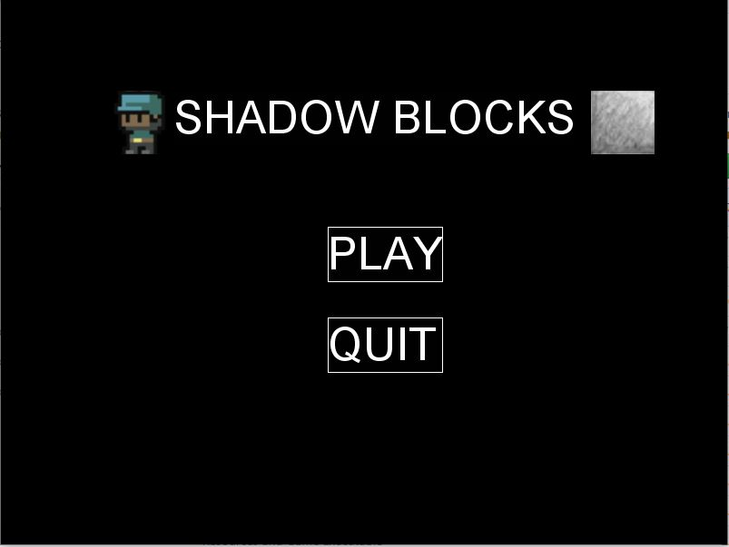

# ShadowBlocks
A Java based puzzle solving arcade game.
Uses Java and Slick2d libraries. 

To play: (For Windows)  
*Requires Java Runtime Environment to run*
1. Download/Clone the repository
2. Run the ShadowBlocks executable 

## Game Menu

## First Level

