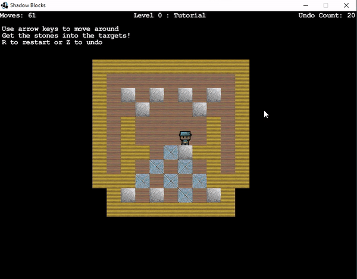
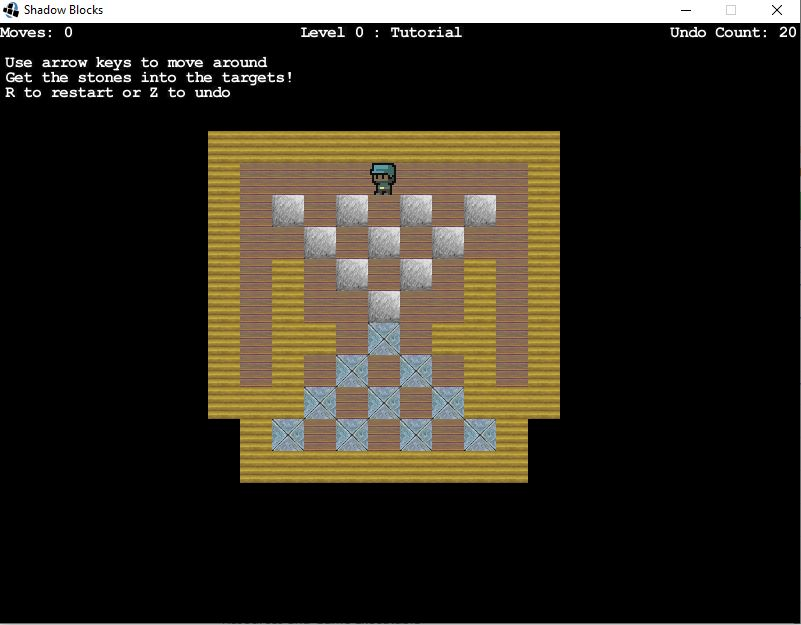

# ShadowBlocks



A Java based puzzle solving arcade game.
Uses Java and Slick2d libraries. 

* Levels designed using csv files in form of 
  -- Map Length, Map Width
  Followed by:
  -- spritename, x_location, y_location
* Uses a Factory Design Pattern to create different sprites on map (in 
Loader.java)
```java
	createObject(String name, float x, float y) {
		switch (name) {
			case "wall":
				return new Wall(name,x, y);
			case "floor":
				return new Floor(name,x, y);
			case "stone":
				return new Stone(name,x, y);
        ....
```
* Includes undo command

To play: (For Windows)  
*Requires Java Runtime Environment to run*
1. Download/Clone the repository
2. Run the ShadowBlocks executable 
## Game Menu




